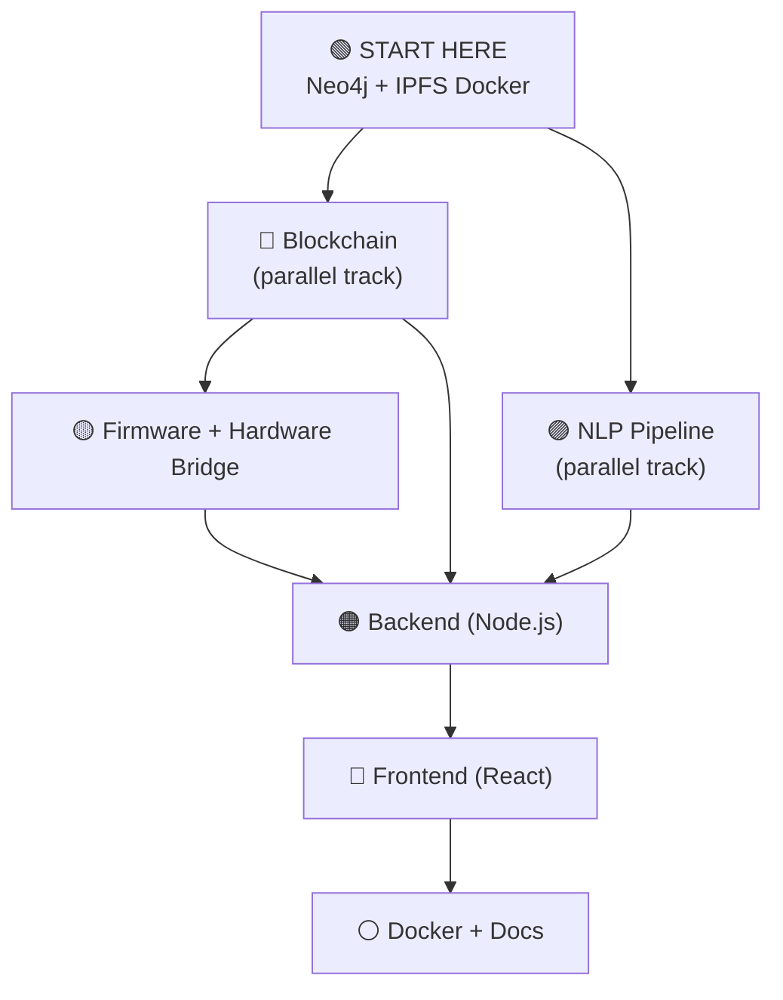

# LexNet — Build Order Guide (Start Here!)

> **🎯 Purpose**: This file tells you exactly which module to code first, second, third... and why.
> Designed for vibe coding — follow this order for the smoothest experience.

---

## The Golden Rule

```
Infrastructure → NLP + Blockchain (parallel) → Firmware + Bridge → Backend → Frontend → Docker → Docs
```

---

## Build Order at a Glance



---

## Detailed Order with Reasoning

### 🟢 Step 0 — Infrastructure Prerequisites (Do this FIRST)
**What**: Start Neo4j + IPFS via Docker
**Time**: 1-2 hours
**Why first**: NLP needs Neo4j. Backend needs both. Get them running before writing any application code.

```bash
# Start Neo4j
docker run -d --name lexnet-neo4j -p 7474:7474 -p 7687:7687 -e NEO4J_AUTH=neo4j/lexnet-neo4j-pass neo4j:5-community

# Start IPFS
docker run -d --name lexnet-ipfs -p 5001:5001 -p 8080:8080 ipfs/kubo:v0.27.0

# Apply Neo4j schema (after creating neo4j/schema.cypher)
```

> Also create Git repo, folder structure, .gitignore, README stubs.

---

### 🔵🟣 Step 1 — Blockchain + NLP Pipeline (IN PARALLEL)

These two modules have **zero dependency on each other**. Build them simultaneously.

#### Track A: NLP Pipeline (`nlp/`)
**Needs**: Neo4j running (from Step 0)
**Needs Backend?**: ❌ No — test standalone with pytest and direct Flask calls

| Phase | What |
|-------|------|
| NLP1 | Setup + OCR (Tesseract) |
| NLP2 | NER (Legal-BERT or spaCy EntityRuler fallback) |
| NLP3 | Relation extraction (rule-based) + data models |
| NLP4 | Neo4j graph insert (MERGE statements) |
| NLP5 | Conflict detection (XGBoost + rule-based) |
| NLP6 | Flask server (`/nlp/process` endpoint) |

```bash
# Test independently — no backend needed
cd nlp && pytest tests/
curl -X POST http://localhost:5500/nlp/process \
  -H "Content-Type: application/json" \
  -d '{"docHash":"abc123","ipfsCID":"bafytest","metadata":{"docType":"sale_deed","ownerId":"PERSON_001"}}'
```

#### Track B: Blockchain (`blockchain/`)
**Needs**: Docker (for Fabric containers)
**Needs Neo4j/NLP?**: ❌ No — completely standalone

| Phase | What |
|-------|------|
| BC1 | Network setup — **use `fabric-samples/test-network` as base** |
| BC2 | Chaincode models + entry point (Go) |
| BC3 | All 8 smart contract functions |
| BC4 | Tests with `shimtest.NewMockStub` + deploy to network |

```bash
# Test independently
cd blockchain/chaincode/lexnet-cc && go test ./...
```

> ⚠️ **WARNING**: Fabric network setup is the #1 time sink. Budget 10+ hours. If stuck >4 hours, consider a mock Fabric service to unblock later steps.

---

### 🟡 Step 2 — Firmware + Hardware Bridge
**Depends on**: Nothing (but best done after blockchain so you can test bridge→backend flow later)
**Why here**: The hardware bridge JWT format is needed by the backend. Building it now means the backend has all upstream interfaces ready.

| Track | Module | Notes |
|-------|--------|-------|
| Firmware | `firmware/` | Build CRC → peripheral drivers → packet builder → main loop. Skip if no STM32 hardware |
| Bridge | `hardware-bridge/` | Build CRC → parser → simulator → JWT → API client → main loop. Test with simulator — no hardware needed |

> **💡 No STM32?** Skip firmware entirely. The simulator generates fake packets that mimic real hardware. Build the bridge + simulator first.

---

### 🟠 Step 3 — Backend (The Central Hub)
**Depends on**: Blockchain chaincode signatures (Step 1), Hardware bridge JWT format (Step 2), Neo4j + IPFS (Step 0)
**Why here**: By now all upstream interfaces are defined — chaincode functions, JWT format, Neo4j schema, NLP endpoint.

**Internal build order**:
```
config/ → types/ → services/ (encryption, hash) → services/ (IPFS, Fabric, Neo4j) →
middleware/ (auth, rate-limit) → rest/ (controllers) → services/ (QR, PDF, NLP trigger) →
graphql/ (schema, resolvers) → index.ts (bootstrap)
```

> **💡 Tip**: Start with `encryptionService` and `hashService` — zero external dependencies, easy to verify.

---

### 🔴 Step 4 — Frontend
**Depends on**: Backend GraphQL/REST endpoints running
**Why last (for app code)**: The frontend consumes all backend APIs.

**Internal build order**:
```
Scaffold + Auth → Login + Navigation → Verify (public) →
Register (with fingerprint) → Graph Explorer (D3.js) →
Dashboard + Conflicts + Timeline → Polish
```

> **💡 Tip**: Build the **Verify page** early — simplest public page, proves the full verification workflow.

---

### ⚪ Step 5 — Docker Compose + Docs (Last)
**Depends on**: Everything else working individually
**Why last**: Docker compose orchestrates all services. Documentation is finalised after implementation is stable.

---

## Quick Reference: Module Dependency Map

| Module | Depends On | Depended On By |
|--------|-----------|----------------|
| **Neo4j/IPFS** (infra) | Docker | Backend, NLP, Frontend (indirectly) |
| **Firmware** | Nothing | Hardware Bridge |
| **Hardware Bridge** | Firmware packet format | Backend (auth endpoint) |
| **Blockchain Network** | Docker | Chaincode |
| **Chaincode** | Blockchain Network | Backend (Fabric service) |
| **Backend** | Chaincode, Bridge JWT, IPFS, Neo4j | Frontend, NLP (trigger) |
| **NLP Pipeline** | Neo4j | Backend (triggered by) |
| **Frontend** | Backend APIs | Nothing |
| **Docker Compose** | All of the above | Nothing |

---

## If You're Solo (Recommended Path)

If you're vibe coding this alone, here's the most efficient path:

```
1. 🟢 Docker: neo4j + ipfs                              — 30 min
2. 🟢 Neo4j schema + seed                               — 1 hr
3. 🟣 NLP Pipeline (OCR → NER → relations → Neo4j)      — 20 hrs
4. 🔵 Blockchain (network + chaincode)                   — 15 hrs
5. 🟡 Hardware bridge + simulator (skip firmware for now) — 8 hrs
6. 🟠 Backend (config → services → REST → GraphQL)       — 30 hrs
7. 🔴 Frontend (auth → verify → register → graph → dash) — 25 hrs
8. ⚪ Docker compose + docs                              — 8 hrs
9. 🔵 Firmware — only if you have STM32 hardware         — 15 hrs
```

**Total estimated**: ~120-130 hours of focused coding

> **💡 Note**: Steps 3 & 4 can be done in parallel if you want to switch between them. They have zero dependency on each other.

---

## What You Can Mock/Skip for MVP

If you're pressed for time, here's what you can substitute:

| Component | Mock/Skip Strategy | Impact |
|-----------|-------------------|--------|
| **Firmware** | Use bridge simulator only | No real fingerprint auth, but full flow works |
| **Hyperledger Fabric** | Use a JSON file store that mimics Fabric's interface | Lose immutability guarantee, but backend logic works |
| **Legal-BERT NER** | Use spaCy EntityRuler with regex patterns | 70-80% accuracy instead of 90%+, much faster to implement |
| **XGBoost conflict model** | Use rule-based scoring only | Less accurate, but deterministic and easy to debug |
| **D3.js graph** | Use a simpler force-graph library like `react-force-graph` | Less control but much easier React integration |

---

## Daily Vibe Coding Checklist

- [ ] Check which step you're on in the build order above
- [ ] Make sure all dependency services are running (Neo4j, IPFS, Fabric)
- [ ] Reference the detailed phases in [`PHASE_WISE_IMPLEMENTATION.md`](file:///d:/LexNet/PHASE_WISE_IMPLEMENTATION.md)
- [ ] After completing a phase, test it independently before moving to the next
- [ ] Commit working code at each phase checkpoint (the "✅ Done when" markers)

---

> **Remember**: The build order exists because of real dependencies — module B literally cannot function without module A. Follow the order to avoid getting stuck on "why doesn't this work?" mysteries.
