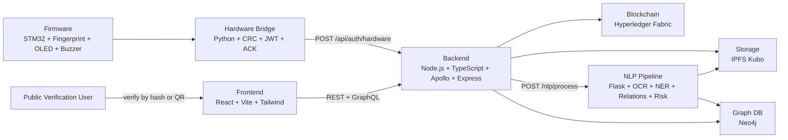
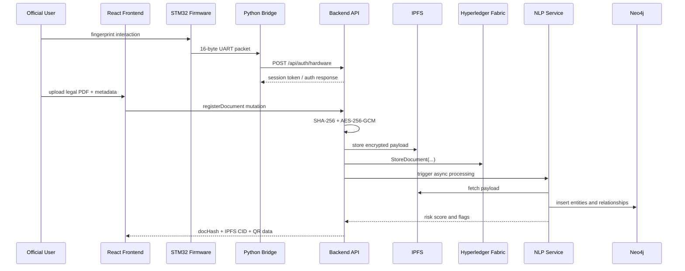
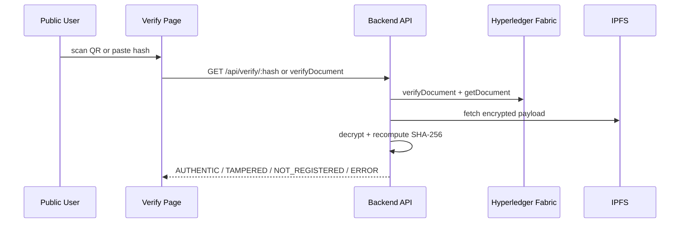

# LexNet

LexNet is a local-first, AI-assisted blockchain legal document networking system built for secure registration, verification, graph analysis, and conflict detection of legal property documents. It combines biometric-assisted authentication, encrypted document storage, blockchain-backed record keeping, Neo4j knowledge graph enrichment, and a React-based verification dashboard.

This README is intentionally detailed so it can serve both as:

1. The main engineering entry point for the repository.
2. A report-ready project reference for academic documentation, viva preparation, and final project writeups.

## Table of Contents

1. [Project Summary](#project-summary)
2. [Problem Statement](#problem-statement)
3. [Project Objectives](#project-objectives)
4. [Functional Requirements](#functional-requirements)
5. [Non-Functional Requirements](#non-functional-requirements)
6. [Why LexNet Matters](#why-lexnet-matters)
7. [System Scope](#system-scope)
8. [Core Constraints](#core-constraints)
9. [Key Features](#key-features)
10. [User Roles](#user-roles)
11. [Architecture Overview](#architecture-overview)
12. [End-to-End Workflows](#end-to-end-workflows)
13. [Module Breakdown](#module-breakdown)
14. [Detailed Module Internals](#detailed-module-internals)
15. [Technology Stack](#technology-stack)
16. [Fixed Inter-Module Contracts](#fixed-inter-module-contracts)
17. [Neo4j Data Model](#neo4j-data-model)
18. [Repository Structure](#repository-structure)
19. [Build Order and Development Roadmap](#build-order-and-development-roadmap)
20. [Environment Configuration](#environment-configuration)
21. [Hardware and Software Requirements](#hardware-and-software-requirements)
22. [Local Setup and Execution](#local-setup-and-execution)
23. [INF2 Future Docker Orchestration Plan](#inf2-future-docker-orchestration-plan)
24. [API Overview](#api-overview)
25. [Sample Data and Demo Assets](#sample-data-and-demo-assets)
26. [Testing Strategy](#testing-strategy)
27. [Representative Validation Results](#representative-validation-results)
28. [Security Design](#security-design)
29. [Current Repository Notes](#current-repository-notes)
30. [Known Limitations](#known-limitations)
31. [Future Enhancements](#future-enhancements)
32. [Suggested Project Report Mapping](#suggested-project-report-mapping)
33. [Useful Internal Documents](#useful-internal-documents)
34. [License](#license)

## Project Summary

LexNet is designed to address the problem of fragmented, difficult-to-verify legal property records by creating a unified workflow that:

- authenticates document registration with hardware-assisted fingerprint validation,
- stores legal documents in encrypted form,
- records immutable metadata on Hyperledger Fabric,
- enriches legal relationships and entity links inside Neo4j,
- computes conflict risk using rule-based and ML-assisted NLP signals,
- supports fast public verification through QR codes and document hashes.

In short, LexNet connects four traditionally separate concerns:

- identity and access validation,
- trusted record keeping,
- document storage and retrieval,
- legal intelligence and conflict analysis.

## Problem Statement

Property and legal document systems often suffer from the following issues:

- records are distributed across different offices and formats,
- document verification is slow and often manual,
- tampering detection is weak when papers are copied or altered,
- ownership history is hard to trace across transfers and disputes,
- legal relationships between people, properties, courts, and documents are not represented in a machine-friendly graph,
- fraud indicators such as rapid transfers, conflicting ownership trails, or dispute-heavy records are not surfaced early.

LexNet proposes a local, open-source, modular platform that makes legal document registration and verification more structured, traceable, and analyzable.

## Project Objectives

The major objectives of the project are:

1. Register legal documents with secure, auditable metadata.
2. Use fingerprint-assisted hardware flow to validate operator presence before registration.
3. Encrypt document payloads before storage.
4. Store document metadata immutably on a blockchain ledger.
5. Store encrypted file payloads in IPFS.
6. Build a legal knowledge graph from document text.
7. Detect fraud and conflict patterns using graph and document features.
8. Allow public verification through a QR code or document hash.
9. Keep the full stack local and reproducible for student-project deployment.

## Functional Requirements

The following functional requirements are useful to state explicitly in a project report because they define what the system is expected to do.

### Authentication and access

- The system shall support demo user login for officials through the frontend and backend.
- The system shall support hardware-assisted authentication using a fingerprint packet from the STM32 side.
- The backend shall verify bridge JWTs before issuing a session JWT.

### Document registration

- The system shall accept legal document PDFs for registration.
- The system shall compute a SHA-256 hash for every uploaded document.
- The system shall encrypt every uploaded document before storage.
- The system shall store the encrypted payload in IPFS.
- The system shall store immutable document metadata in Hyperledger Fabric.
- The system shall generate QR verification data for registered documents.

### Document verification

- The system shall allow public verification by SHA-256 hash.
- The system shall allow QR-based verification through a generated verification URL.
- The system shall return one of `AUTHENTIC`, `TAMPERED`, `NOT_REGISTERED`, or `ERROR`.

### Legal intelligence and graph features

- The system shall extract text from uploaded PDFs.
- The system shall identify legal entities such as people, property IDs, dates, organisations, and legal sections.
- The system shall convert extracted information into graph relationships.
- The system shall insert graph entities and relations into Neo4j using `MERGE`.
- The system shall compute a conflict or fraud risk score for processed documents.

### Frontend and analysis

- The system shall show an official dashboard.
- The system shall show a public verification interface.
- The system shall support graph exploration and node search.
- The system shall support property timeline views.
- The system shall support flagged-document and conflict views.

## Non-Functional Requirements

These are equally important for a project report because they explain quality attributes and design decisions.

### Security

- Documents must be encrypted with AES-256-GCM before storage.
- Document identifiers must use SHA-256 lowercase hex.
- UART communication must use CRC-16/CCITT integrity checks.
- Backend APIs must use HS256 JWTs for auth.
- Backend must sanitize untrusted string inputs.
- Cypher queries must be parameterized.

### Reliability

- Every major error path should produce a defined outcome rather than silent failure.
- NLP failures must not block the registration workflow.
- Dockerized infra should expose health checks where applicable.

### Maintainability

- The repository must follow a fixed directory structure.
- Modules must interact through explicit contracts rather than implicit assumptions.
- TypeScript uses strict typing and Zod validation.
- Python services use typed functions and structured models.

### Portability

- The full system is intended to run locally on a student machine.
- Hybrid operation is supported when Docker storage is limited.
- Hardware-bridge TCP simulator mode allows development without real serial hardware.

### Performance expectations

- Verification should remain a relatively lightweight lookup-and-compare flow.
- NLP is intentionally asynchronous to keep registration responsive.
- Graph search and timeline views depend on indexes and Neo4j constraints for acceptable local performance.

## Why LexNet Matters

LexNet is valuable as a project because it demonstrates how multiple advanced technologies can be combined into a single coherent system:

- embedded systems,
- secure networking,
- blockchain,
- distributed storage,
- graph databases,
- natural language processing,
- web APIs,
- frontend visualization.

This makes it a strong capstone-style system because it is not a toy CRUD application. It is an end-to-end platform with real architectural boundaries, explicit contracts, security rules, and domain-specific reasoning.

## System Scope

### In scope

- Local document registration and verification
- Hyperledger Fabric-backed document metadata
- IPFS-backed encrypted payload storage
- Neo4j graph insertion and graph search
- OCR, NER, relation extraction, and conflict scoring
- Dashboard views, graph views, timeline views, and verification flow
- Hardware bridge simulator support for systems without STM32 hardware

### Out of scope

- Public cloud deployment
- Production-grade identity management
- PKI-based JWT signing
- Real biometric template storage
- Full legal document standardization across all jurisdictions
- Guaranteed production-level legal accuracy from NLP models

## Core Constraints

These are mandatory project constraints enforced throughout the repository:

1. Fully local operation on localhost.
2. Open-source tooling only, except optional Indian Kanoon non-commercial access.
3. Security cannot be skipped for convenience.
4. No placeholder implementations for core logic.
5. Every major error path must be handled.

## Key Features

- Fingerprint-assisted authentication flow using STM32 packet exchange
- CRC-protected UART communication
- HS256 bridge and session JWTs
- AES-256-GCM document encryption before storage
- SHA-256 document hashing for identity and verification
- Hyperledger Fabric document registration, transfer, dispute, and history operations
- IPFS encrypted payload storage
- Neo4j legal entity graph with labels and relationships tailored to legal/property data
- OCR-first NLP pipeline with Legal-BERT or fallback extraction
- Conflict scoring using graph features and synthetic training data
- Public verification using QR or hash
- Frontend views for login, registration, verification, graph exploration, conflicts, and timelines

## User Roles

LexNet currently models the following application roles:

| Role | Purpose |
| --- | --- |
| `admin` | Administrative access for demo use |
| `registrar` | Official user for document registration workflows |
| `clerk` | Supporting official user for review and operations |
| `official` | Role issued after successful hardware bridge authentication |
| public verifier | End-user verifying a document through QR or hash lookup |

Hardcoded demo accounts:

| Username | Password | Role |
| --- | --- | --- |
| `admin` | `admin123` | admin |
| `registrar` | `reg456` | registrar |
| `clerk` | `clerk789` | clerk |

## Architecture Overview

LexNet uses a multi-layer architecture with strict boundaries between modules.



### Architectural idea

The backend is the central coordinator, but not the owner of all logic:

- blockchain owns ledger truth,
- IPFS owns encrypted payload persistence,
- NLP owns graph enrichment and risk computation,
- Neo4j owns legal relationship traversal,
- hardware bridge owns biometric packet validation.

This separation makes the system easier to explain in a report and easier to test module by module.

## End-to-End Workflows

### Workflow A: Document registration



High-level steps:

1. Official authenticates through hardware-assisted flow.
2. Document is uploaded to backend.
3. Backend computes SHA-256.
4. Backend encrypts the document using AES-256-GCM.
5. Backend stores encrypted payload in IPFS.
6. Backend stores immutable metadata in Fabric.
7. Backend generates QR verification data.
8. Backend triggers asynchronous NLP analysis.
9. NLP extracts entities, relations, and risk features.
10. Neo4j graph and conflict data become available for dashboard views.

### Workflow B: Public document verification



Verification states:

- `AUTHENTIC`
- `TAMPERED`
- `NOT_REGISTERED`
- `ERROR`

## Module Breakdown

LexNet contains 7 major modules.

### 1. Firmware (`firmware/`)

Purpose:

- interface with fingerprint hardware,
- show user feedback on OLED,
- drive buzzer success/failure signals,
- package UART authentication packets.

Important responsibilities:

- CRC generation,
- packet serialization,
- ACK handling,
- scan loop and retry behavior.

### 2. Hardware Bridge (`hardware-bridge/`)

Purpose:

- read packets from serial or TCP simulator,
- validate CRC, timestamp freshness, and score threshold,
- generate short-lived bridge JWTs,
- call backend hardware-auth endpoint,
- return `0x01` or `0xFF` to the firmware side.

Important note:

- Windows development can use TCP simulator mode instead of virtual COM ports.

### 3. Blockchain (`blockchain/`)

Purpose:

- host Hyperledger Fabric network configuration,
- define and deploy chaincode,
- preserve immutable document registration records,
- support ownership transfer, dispute handling, and history queries.

Main chaincode operations:

- `StoreDocument`
- `GetDocument`
- `GetDocumentHistory`
- `TransferDocument`
- `AddDispute`
- `ResolveDispute`
- `GetDocumentsByOwner`
- `VerifyDocument`

### 4. Backend (`backend/`)

Purpose:

- provide REST and GraphQL APIs,
- validate env vars and inputs,
- interact with Fabric, IPFS, Neo4j, and NLP,
- manage encryption, hashing, QR generation, and verification logic.

Important services:

- `encryptionService`
- `hashService`
- `ipfsService`
- `fabricService`
- `neo4jService`
- `qrService`
- `nlpTriggerService`

### 5. NLP Pipeline (`nlp/`)

Purpose:

- fetch stored documents,
- extract text from PDFs,
- identify legal entities,
- derive legal relations,
- insert graph knowledge into Neo4j,
- compute conflict/risk scores.

Pipeline stages:

1. OCR
2. NER
3. Relation extraction
4. Graph insertion
5. Conflict scoring

### 6. Frontend (`frontend/`)

Purpose:

- provide official dashboard and registration UI,
- provide public verification interface,
- render knowledge graph and timelines,
- display risk alerts and document details.

Key views:

- Login
- Dashboard
- Register Document
- Verify Document
- Graph Explorer
- Conflict Feed
- Timeline
- Document Detail

### 7. Infrastructure and Support (`neo4j/`, `docker/`, `data/`, `docs/`)

Purpose:

- define graph schema and seed data,
- define containerized local runtime,
- generate demo PDFs and conflict training data,
- document the architecture and contracts.

## Detailed Module Internals

This section goes a level deeper than the module summary and is intended to be directly useful for implementation chapters in a project report.

### Firmware module: detailed design

Although the current firmware source tree is still scaffold-heavy, the intended firmware architecture is already clearly defined by the project contracts and phase plan.

#### Hardware role in the system

The firmware module is responsible for the physical-facing side of the authentication flow:

- interacting with the fingerprint sensor,
- driving the OLED display,
- handling buzzer feedback,
- building the authentication packet sent to the Python bridge,
- waiting for bridge acknowledgement.

#### Planned peripherals

- `USART2` for UART packet transmission at `57600 8N1`
- `I2C1` for SSD1306 OLED control
- GPIO control for the buzzer
- UART-linked fingerprint sensor driver for the R307 module

#### Planned internal phases

1. CRC setup and validation parity with Python bridge
2. peripheral driver implementation
3. UART packet struct and ACK handling
4. full main-loop integration
5. retries, timeouts, and error polish

#### Planned firmware state flow

1. Initialize HAL and board peripherals.
2. Display a prompt such as `Place finger`.
3. Capture fingerprint input.
4. Match against the stored template/search flow.
5. If match is acceptable, build the packet:
   `device_id + finger_score + timestamp + crc16`
6. Send the packet to the Python bridge.
7. Wait for bridge ACK.
8. Show success or failure on OLED and buzzer.
9. Return to idle and wait for the next authentication cycle.

#### Planned error behaviors

- Sensor unavailable -> show sensor error and retry
- UART timeout -> retry transmission before declaring communication failure
- Bridge rejection -> buzzer fail and display error state
- invalid internal error -> `Error_Handler()` enters non-returning fail loop

#### Why the firmware matters in the report

This module demonstrates that LexNet is not only a software stack. It includes an embedded edge-authentication component, which strengthens the originality and system-integration depth of the project.

### Hardware bridge: detailed design

The hardware bridge is the translation layer between low-level firmware packets and high-level backend authentication.

#### Input

- 16-byte UART or TCP-simulated authentication packet

#### Processing stages

1. Read exactly 16 bytes.
2. Parse with `struct.unpack('<4sHQH')`.
3. Validate CRC.
4. Validate score threshold.
5. Validate timestamp freshness.
6. Generate a 5-minute HS256 bridge JWT.
7. Send it to `POST /api/auth/hardware`.
8. Return `0x01` or `0xFF` back to the firmware side.

#### Development convenience

The bridge supports:

- serial mode for real hardware,
- TCP mode for simulator-based testing on Windows.

This is important for a project report because it shows the team considered hardware availability constraints and still preserved interface fidelity.

### Blockchain module: detailed design

The blockchain module is the source of truth for document registration history.

#### Network role

- two organizations: government side and verifier side
- orderer-based Fabric network
- CA containers for identity material
- local test-network-style structure adapted for LexNet

#### Ledger role

The ledger stores:

- document hash,
- IPFS CID,
- owner ID,
- device ID,
- timestamp,
- document type,
- metadata JSON,
- dispute state,
- risk score,
- creation time.

#### Why blockchain is used

The main benefit is immutability and history:

- ownership changes can be tracked,
- disputes can block transfers,
- verification can rely on a stable ledger lookup.

### Backend module: detailed design

The backend is the orchestration core of LexNet.

#### Main sublayers

- configuration and env validation
- logging
- middleware
- REST controllers
- GraphQL schema and resolvers
- integration services

#### Backend responsibilities

- validate hardware and user auth
- hash and encrypt files
- upload and retrieve data from IPFS
- call Fabric chaincode functions
- query Neo4j
- generate QR data
- trigger NLP
- perform public verification logic

#### Why backend complexity is justified

This layer is the integration point across almost every subsystem, so it naturally contains the most orchestration logic in the project.

### NLP module: detailed design

The NLP module converts legal PDFs into searchable graph intelligence and risk information.

#### Pipeline logic

1. Fetch the stored payload from IPFS.
2. Extract text from the PDF.
3. Clean OCR artifacts and normalize text.
4. Run NER for legal entities.
5. Run relation extraction rules.
6. Insert graph triples into Neo4j.
7. Compute risk score from graph and metadata features.

#### Hybrid intelligence strategy

The NLP design intentionally supports both:

- transformer-based extraction,
- fallback rule-based extraction.

This is a strong report point because it shows graceful degradation and practical engineering tradeoffs.

### Frontend module: detailed design

The frontend is split between official workflows and public verification.

#### Official views

- Login
- Dashboard
- Registration
- Conflict feed
- Graph explorer
- Timeline
- Document detail

#### Public views

- Verify by hash
- Verify by QR

#### Visualization strategy

For graph rendering, the project follows:

- D3 for layout math
- React for DOM rendering

This avoids imperative DOM conflicts and is a good design rationale to mention in a report.

### Infrastructure module: detailed design

The infrastructure module is split conceptually into three phases:

#### INF1

- Neo4j schema
- Neo4j seed data

#### INF2

- Docker Compose orchestration
- Dockerfiles for backend, NLP, and bridge
- health checks, env wiring, named volumes, service dependencies

#### INF3

- sample PDF generation
- conflict training data generation
- external legal-data fetch helper
- technical documentation

## Technology Stack

| Layer | Technology |
| --- | --- |
| Firmware | C, STM32CubeIDE, HAL, STM32 F446RE |
| Hardware bridge | Python 3.11, pyserial, PyJWT, python-dotenv |
| Blockchain | Hyperledger Fabric 2.x |
| Chaincode | Go 1.21 with `contractapi` |
| Backend | Node.js 20, TypeScript, Express, Apollo Server, Zod, Winston |
| NLP | Python 3.11, Flask, transformers, spaCy, Tesseract, XGBoost |
| Graph DB | Neo4j Community 5.x |
| Storage | IPFS Kubo 0.27.0 |
| Frontend | React 18, Vite, TailwindCSS 3, Apollo Client, D3.js |
| Container orchestration | Docker Compose 3.8 |

## Fixed Inter-Module Contracts

These contracts are central to the project and should be highlighted in a report because they demonstrate disciplined interface design.

### UART packet: STM32 <-> Python bridge

| Offset | Size | Field | Encoding |
| --- | ---: | --- | --- |
| `0` | `4` | `DEVICE_ID` | 4 raw bytes, little-endian |
| `4` | `2` | `FINGER_SCORE` | `uint16_t`, little-endian |
| `6` | `8` | `TIMESTAMP` | `uint64_t`, little-endian |
| `14` | `2` | `CRC16` | CRC-16/CCITT over bytes `0..13` |

Rules:

- Baud rate `57600`
- Mode `8N1`
- ACK `0x01 = SUCCESS`, `0xFF = FAILURE`
- Python decode format: `struct.unpack('<4sHQH', raw_bytes)`

### Bridge JWT

```json
{
  "device_id": "A1B2C3D4",
  "finger_score": 85,
  "iat": 1710500000,
  "exp": 1710500300,
  "iss": "lexnet-bridge"
}
```

Rules:

- algorithm `HS256`
- expiry `5 minutes`
- backend must validate `iss === "lexnet-bridge"` and `finger_score >= 60`

### Session JWT

```json
{
  "userId": "registrar",
  "role": "registrar",
  "iat": 1710500000,
  "exp": 1710503600
}
```

Rules:

- algorithm `HS256`
- expiry `1 hour`

### Backend -> NLP trigger

```json
{
  "docHash": "sha256hex",
  "ipfsCID": "bafy...",
  "metadata": {
    "docType": "sale_deed",
    "ownerId": "PERSON_001"
  }
}
```

Response shape:

```json
{
  "status": "completed",
  "riskScore": 72.5,
  "entitiesFound": 9,
  "triplesInserted": 6,
  "flags": ["RAPID_TRANSFER"],
  "processingTimeMs": 1243
}
```

Important rule:

- NLP failure must never block document registration.

### Chaincode signatures

These signatures must remain stable:

- `StoreDocument(docHash, ipfsCID, ownerID, deviceID, timestamp, docType, metadataJsonString)`
- `GetDocument(docHash)`
- `GetDocumentHistory(docHash)`
- `TransferDocument(docHash, newOwnerID)`
- `AddDispute(docHash, caseID, filedBy)`
- `ResolveDispute(docHash, caseID)`
- `GetDocumentsByOwner(ownerID)`
- `VerifyDocument(docHash)`

## Neo4j Data Model

### Node labels

- `Person`
- `Property`
- `Document`
- `Court`
- `LegalAct`
- `Organisation`

### Relationship types

- `OWNS`
- `REFERENCES`
- `INVOLVES`
- `CONCERNS`
- `ISSUED`
- `DISPUTES`
- `SUPERSEDES`

### Critical constraints

Core constraints that must always exist:

- `document_hash`
- `property_id`
- `person_name_id`
- `court_name`
- `legalact_name_section`
- `org_name`

### Why Neo4j is used

Neo4j is a natural fit because legal and property systems are deeply relational:

- a person can own multiple properties,
- a document can involve multiple people,
- a court can issue multiple orders,
- disputes link documents and properties,
- superseding legal instruments form chains of authority.

This makes graph traversal much more expressive than trying to force the same logic into a flat relational table model for the demo scope.

## Repository Structure

Top-level repository layout:

```text
LexNet/
|-- backend/
|-- blockchain/
|-- data/
|-- docker/
|-- docs/
|-- firmware/
|-- frontend/
|-- hardware-bridge/
|-- neo4j/
|-- nlp/
|-- planning/
|-- AGENTS.md
|-- BUILD_ORDER.md
|-- PHASE_WISE_IMPLEMENTATION.md
|-- README.md
```

### Folder guide

| Path | Purpose |
| --- | --- |
| `backend/` | REST + GraphQL backend |
| `blockchain/` | Fabric network config and Go chaincode |
| `data/` | sample PDFs, conflict CSV, data utility scripts |
| `docker/` | container definitions and runtime notes |
| `docs/` | architecture, API, deployment, security docs |
| `firmware/` | STM32 code and project config |
| `frontend/` | React UI |
| `hardware-bridge/` | UART/TCP bridge, simulator support, bridge tests |
| `neo4j/` | graph schema and seed data |
| `nlp/` | OCR, NER, relations, graph insert, conflict scoring |
| `planning/` | implementation planning artifacts |

## Build Order and Development Roadmap

The intended implementation sequence is:

1. Neo4j + IPFS
2. NLP pipeline + blockchain in parallel
3. Firmware + hardware bridge
4. Backend
5. Frontend
6. Docker Compose + documentation

This order matters because:

- backend depends on chaincode contracts,
- backend depends on IPFS and Neo4j,
- backend relies on bridge JWT contract,
- frontend depends on backend APIs,
- documentation and orchestration are most accurate after feature stabilization.

Detailed references:

- [BUILD_ORDER.md](BUILD_ORDER.md)
- [PHASE_WISE_IMPLEMENTATION.md](PHASE_WISE_IMPLEMENTATION.md)

## Environment Configuration

Every service has its own `.env` file and `.env.example`.

### Service-level env files

- `backend/.env`
- `nlp/.env`
- `hardware-bridge/.env`
- `frontend/.env`

### Cross-service rules

- `JWT_SECRET` must be identical in backend and hardware bridge
- Neo4j and IPFS endpoint settings must align between backend and NLP
- `VITE_` variables are required for frontend browser access

The root reference file is:

- [`.env.example`](.env.example)

## Hardware and Software Requirements

This section is useful for the report chapter on system requirements.

### Hardware requirements

Minimum practical development machine:

- 64-bit Windows/Linux machine
- 8 GB RAM recommended
- stable free disk space for Docker images and local dependencies
- internet access for one-time package/model pulls

Optional hardware for full embedded demonstration:

- STM32 Nucleo F446RE
- R307 fingerprint sensor
- SSD1306 OLED display
- buzzer
- USB or UART connectivity accessories

### Software requirements

- Node.js 20
- npm
- Python 3.11
- Go 1.21
- Docker Desktop
- Git
- Tesseract OCR
- Git Bash or WSL for shell-script-based Fabric setup on Windows

### Browser and UI requirements

- a modern Chromium-based browser or Firefox for frontend testing
- Neo4j Browser accessible on `http://localhost:7474`

## Local Setup and Execution

### Prerequisites

- Node.js 20
- Python 3.11
- Go 1.21
- Docker Desktop
- Tesseract OCR
- Git Bash or WSL if you want to run the Fabric shell scripts directly on Windows

### Recommended development mode

For many machines, the most practical setup is a hybrid mode:

- keep `Neo4j`, `IPFS`, and `Fabric` in Docker,
- run `backend`, `frontend`, `nlp`, and `hardware-bridge` locally.

This reduces Docker footprint while preserving the infra pieces that are hardest to run natively.

### Start Neo4j and IPFS

```powershell
cd docker
docker compose up -d neo4j ipfs
```

### Start Fabric network

```bash
bash blockchain/network/scripts/setup-network.sh
```

Or, if the containers are already created, start them from Docker Desktop.

### Apply Neo4j schema

```powershell
Get-Content -Raw neo4j\schema.cypher | docker exec -i lexnet-neo4j cypher-shell -u neo4j -p lexnet-neo4j-pass
```

### Optional seed data

```powershell
Get-Content -Raw neo4j\seed.cypher | docker exec -i lexnet-neo4j cypher-shell -u neo4j -p lexnet-neo4j-pass
```

### Run backend

```powershell
cd backend
npm install
npm run build
npm run dev
```

### Run frontend

```powershell
cd frontend
npm install
npm run dev
```

### Run NLP

```powershell
cd nlp
python -m venv .venv
.\.venv\Scripts\Activate.ps1
pip install -r requirements.txt
python -m src.app
```

### Run hardware bridge

TCP simulator mode:

```powershell
cd hardware-bridge
python -m venv .venv
.\.venv\Scripts\Activate.ps1
pip install -r requirements.txt
python -m src.bridge --tcp --tcp-host localhost --tcp-port 9600
```

Serial mode:

```powershell
python -m src.bridge --serial COM3
```

### Port assignments

| Service | Port |
| --- | ---: |
| Frontend | `3000` |
| Backend | `4000` |
| NLP | `5500` |
| Neo4j Browser | `7474` |
| Neo4j Bolt | `7687` |
| IPFS API | `5001` |
| IPFS Gateway | `8080` |
| STM32 simulator TCP mode | `9600` |

## INF2 Future Docker Orchestration Plan

Phase `INF2` is important enough to document in advance because it represents the shift from module-by-module execution to reproducible system orchestration.

### Current state

The current `docker/docker-compose.yml` already defines:

- `neo4j`
- `ipfs`
- `nlp`

The current Dockerfiles show mixed maturity:

- `docker/nlp.Dockerfile` is already substantive and installs Tesseract, Python deps, and spaCy model assets.
- `docker/backend.Dockerfile` is currently minimal and needs completion for full service packaging.
- `docker/bridge.Dockerfile` is currently minimal and needs completion for bridge-container execution.

### Target state for INF2 completion

The eventual target of `INF2` should be a local orchestration file that can boot the major runtime services with minimal manual steps.

#### Planned runtime services

- `neo4j`
- `ipfs`
- `backend`
- `nlp`
- `bridge-sim`
- `frontend`

#### Planned INF2 capabilities

- service-level health checks
- consistent env-file wiring
- named volumes for persistent data
- startup dependencies between services
- exposed ports aligned with project standards
- containerized NLP runtime
- optional bridge simulator for no-hardware demo mode

#### Why INF2 matters for the report

INF2 is not only a DevOps detail. It proves:

- reproducibility,
- deployment discipline,
- demo readiness,
- easier evaluation on another system.

#### Honest current note

For report accuracy:

- INF2 is conceptually defined and partially scaffolded,
- but the full-stack one-command orchestration is still a future completion target rather than the current final state.

## API Overview

### REST endpoints

- `GET /api/health`
- `POST /api/auth/login`
- `POST /api/auth/hardware`
- `GET /api/verify/:hash`
- `GET /api/documents/:hash/pdf`

### GraphQL highlights

Queries:

- `getDocument`
- `getDocumentHistory`
- `verifyDocument`
- `getDocumentsByOwner`
- `getKnowledgeGraph`
- `searchNodes`
- `getPropertyTimeline`
- `getDocumentEvents`
- `getConflicts`
- `getRiskScore`
- `getFlaggedDocuments`

Mutations:

- `login`
- `registerDocument`
- `transferDocument`
- `addDispute`
- `resolveDispute`

Detailed API reference:

- [docs/api-contract.md](docs/api-contract.md)

## Sample Data and Demo Assets

LexNet includes data generation and demo support assets for report screenshots, testing, and walkthroughs.

### Sample PDFs

Generated documents:

- `data/sample-documents/sale_deed_01.pdf`
- `data/sample-documents/court_order_01.pdf`
- `data/sample-documents/land_record_01.pdf`

Generator:

```powershell
python data\scripts\generate_synthetic.py
```

### Synthetic conflict dataset

CSV generator:

```powershell
python data\scripts\generate_conflict_data.py --rows 500
```

Output:

- `data/conflict_training.csv`

### Optional Indian Kanoon fetch helper

The repo includes a helper for pulling sample case results using the official Indian Kanoon API documentation:

- [Indian Kanoon API documentation](https://api.indiankanoon.org/documentation/)

Usage:

```powershell
$env:INDIANKANOON_API_TOKEN="your-token"
python data\scripts\fetch_indiankanoon.py --query '"property dispute" ANDD registration' --limit 3
```

## Testing Strategy

The project is designed for modular testing because multiple technologies interact across boundaries.

### Module-wise testing

| Module | Framework | Focus |
| --- | --- | --- |
| hardware bridge | `pytest` | CRC, parsing, JWT generation, full bridge loop |
| chaincode | Go testing + mocks | all 8 chaincode functions and edge cases |
| backend | `jest` + `ts-jest` | services, controllers, integration flow |
| NLP | `pytest` | OCR, NER, relations, graph insert, conflict scoring |
| frontend | `vitest` + RTL | login and verification UX |

### Representative commands

Backend:

```powershell
cd backend
npm test
```

Frontend:

```powershell
cd frontend
npm test
```

Hardware bridge:

```powershell
cd hardware-bridge
pytest
```

NLP:

```powershell
cd nlp
pytest
```

Chaincode:

```bash
cd blockchain/chaincode/lexnet-cc
go test ./...
```

Fabric smoke validation:

```powershell
powershell -ExecutionPolicy Bypass -File blockchain\network\scripts\bc4-smoke.ps1
```

## Representative Validation Results

This section is designed for direct reuse in a project report. It separates:

1. repo-backed validation snapshots grounded in the current repository and local checks,
2. clearly labeled mock/demo results that can be used as report formatting examples.

### A. Repo-backed validation snapshots

#### Infrastructure and schema snapshot

From the documented local pre-NLP validation flow:

| Check | Result |
| --- | --- |
| Docker daemon | available during validation |
| Neo4j container | reachable |
| IPFS container | reachable |
| Neo4j schema | applied successfully |
| Neo4j constraints | `person_name_id`, `property_id`, `document_hash`, `court_name`, `legalact_name_section`, `org_name` |
| Neo4j indexes | `doc_type_idx`, `doc_date_idx`, `doc_risk_idx`, `property_survey_idx`, `node_name_search` |

#### Blockchain smoke snapshot

Documented in [docs/pre-nlp-checklist.md](docs/pre-nlp-checklist.md):

| Check | Result |
| --- | --- |
| BC4 smoke script | passed |
| Channel | `lexnet-channel` |
| Chaincode | `lexnet-cc` |
| Smoke document hash | `doc-smoke-20260405114204601` |
| `GetDocument` | returned stored record |
| `VerifyDocument` | returned `EXISTS` |

#### NLP runtime snapshot

Documented preflight results:

| Check | Result |
| --- | --- |
| NLP health endpoint | returned runtime-ready status during documented validation |
| Tesseract | resolved inside selected runtime |
| Legal-BERT path | exists |
| conflict model path | exists |
| spaCy model | loaded |

#### Sample data snapshot

Current generated sample PDFs in the repository:

| File | Size (bytes) |
| --- | ---: |
| `sale_deed_01.pdf` | `3052` |
| `court_order_01.pdf` | `3099` |
| `land_record_01.pdf` | `3032` |

Synthetic conflict dataset snapshot:

| Artifact | Value |
| --- | --- |
| file | `data/conflict_training.csv` |
| line count | `1001` |
| interpretation | `1000` data rows plus header |

#### Neo4j seed dataset shape

The current seed design provides a useful report-ready demo graph with:

| Entity type | Count |
| --- | ---: |
| Person | `10` |
| Property | `5` |
| Document | `8` |
| Court | `2` |
| LegalAct | `3` |
| Organisation | `3` |

This gives enough data to demonstrate:

- ownership links,
- dispute links,
- legal references,
- court-issued document relations,
- risk-flagged document examples.

### B. Mock/demo functional results

The following table is intentionally labeled as illustrative mock/demo output. It is useful when drafting result tables in the report before all live screenshots are finalized.

| Scenario | Input | Expected system behavior | Illustrative demo result |
| --- | --- | --- | --- |
| Valid hardware auth | device `A1B2C3D4`, score `85` | bridge JWT accepted and official session issued | `HTTP 200`, role `official`, expiry `1h` |
| Invalid CRC packet | corrupted final 2 bytes | packet rejected and ACK failure sent | `ACK = 0xFF` |
| Low fingerprint score | score `42` | backend auth should not proceed | `Authentication rejected` |
| Authentic document verify | valid blockchain record + matching decrypted hash | verification should succeed | `status = AUTHENTIC` |
| Tampered document verify | valid blockchain record + mismatched recomputed hash | tampering should be detected | `status = TAMPERED` |
| Unknown document verify | hash not found on Fabric | not registered response | `status = NOT_REGISTERED` |
| High-risk conflict document | repeated ownership transfer + dispute markers | risk score and flags raised | `riskScore ~ 80+`, flags include `RAPID_TRANSFER` |

### C. Example report-friendly result narrative

You can adapt the following wording directly into a report:

> During local validation, the Neo4j schema was applied successfully and the core graph constraints and indexes were confirmed. The blockchain smoke script also passed, demonstrating successful document storage and verification operations on the Fabric network. Sample legal PDFs and synthetic conflict data were generated successfully, providing repeatable demo assets for OCR, graph enrichment, and conflict-detection workflows.

## Security Design

Security is a first-class part of LexNet rather than an optional add-on.

### Core controls

- AES-256-GCM for document encryption
- SHA-256 lowercase hex for document hashes
- HS256 JWTs for bridge and session authentication
- CRC-16/CCITT for UART integrity checks
- Zod-based validation for backend env vars and inputs
- DOMPurify sanitization for backend string inputs
- Winston logging with secret redaction
- Rate limiting on global and auth routes
- parameterized Cypher for Neo4j access

### Why this matters for the report

This section is important in a project report because it shows the system is not only functional but also designed with secure-by-default decisions across:

- storage,
- transport,
- authentication,
- input handling,
- logging,
- graph and database access.

Detailed reference:

- [docs/security.md](docs/security.md)

## Current Repository Notes

This section reflects the repository as it exists, which is useful for accurate reporting.

### Present in the repo

- multi-module source structure across backend, blockchain, bridge, firmware, NLP, frontend, and infra
- Neo4j schema and seed files
- sample data generation scripts
- report-supporting docs under `docs/`
- Fabric smoke validation script
- backend, frontend, NLP, and bridge codebases with tests and configs

### Important implementation note about Docker

The repository contains a `docker/docker-compose.yml`, but the current compose scope is not yet a full one-command deployment of every service. At present it focuses on:

- `neo4j`
- `ipfs`
- `nlp`

Fabric is managed separately through the blockchain network scripts, and many development workflows are most practical in hybrid mode.

That is worth stating clearly in a project report so the report stays honest about the current orchestration maturity.

## Known Limitations

1. Demo user auth is hardcoded and not production-grade.
2. Docker orchestration is not yet a full-stack single-command deployment.
3. Legal-BERT quality depends on available model assets and tuning effort.
4. The project is local-first and not designed for internet-scale deployment.
5. Hardware integration may be replaced with simulator mode on machines without STM32 hardware.
6. Conflict scoring is suitable for academic demonstration, not legal adjudication.
7. Indian Kanoon integration is optional and depends on external token access.

## Future Enhancements

Potential future improvements include:

- full-stack Docker Compose orchestration including backend, frontend, and bridge simulator,
- stronger identity and access control,
- richer document ingestion and metadata extraction,
- model fine-tuning for better legal NER accuracy,
- more advanced fraud analytics and graph anomaly detection,
- digital signature integration,
- richer audit dashboards and administrative reports,
- deployment presets for on-premise institutions.

## Suggested Project Report Mapping

This README is designed so you can directly reuse sections while writing the project report.

### Suggested chapter mapping

| Report chapter | README section to reuse |
| --- | --- |
| Abstract | [Project Summary](#project-summary) |
| Introduction | [Problem Statement](#problem-statement), [Why LexNet Matters](#why-lexnet-matters) |
| Objectives | [Project Objectives](#project-objectives) |
| Scope and constraints | [System Scope](#system-scope), [Core Constraints](#core-constraints) |
| Proposed system | [Architecture Overview](#architecture-overview), [Module Breakdown](#module-breakdown) |
| Methodology | [End-to-End Workflows](#end-to-end-workflows), [Fixed Inter-Module Contracts](#fixed-inter-module-contracts) |
| Tools and technologies | [Technology Stack](#technology-stack) |
| Implementation details | [Module Breakdown](#module-breakdown), [Repository Structure](#repository-structure) |
| Testing and validation | [Testing Strategy](#testing-strategy) |
| Security considerations | [Security Design](#security-design) |
| Limitations | [Known Limitations](#known-limitations) |
| Future scope | [Future Enhancements](#future-enhancements) |

### Report writing tips

- Use the architecture diagram and workflow diagrams directly in the report.
- Mention the fixed contracts to show disciplined modular design.
- Highlight the hybrid nature of embedded systems, blockchain, NLP, and graph analytics.
- Be explicit about what is fully implemented versus what is a current limitation.
- Include screenshots from the frontend, Neo4j Browser, and Fabric smoke validation where possible.

## Useful Internal Documents

These files are especially useful while coding and while preparing the report:

- [BUILD_ORDER.md](BUILD_ORDER.md)
- [PHASE_WISE_IMPLEMENTATION.md](PHASE_WISE_IMPLEMENTATION.md)
- [AGENTS.md](AGENTS.md)
- [docs/architecture.md](docs/architecture.md)
- [docs/api-contract.md](docs/api-contract.md)
- [docs/uart-protocol.md](docs/uart-protocol.md)
- [docs/deployment-guide.md](docs/deployment-guide.md)
- [docs/security.md](docs/security.md)
- [docs/pre-nlp-checklist.md](docs/pre-nlp-checklist.md)

## License

This project is released under the [MIT License](LICENSE).
