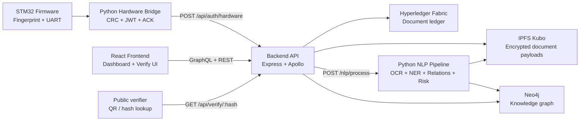

# LexNet Architecture

LexNet is a local-first legal document verification system that combines biometric authentication, blockchain-backed registration, encrypted content storage, graph enrichment, and public verification. The system is intentionally split into strict modules so each layer can be developed and tested independently.

## Modules

1. `firmware/`
   STM32 firmware captures fingerprint matches, packages UART auth packets, and waits for a 1-byte ACK from the bridge.
2. `hardware-bridge/`
   Python bridge validates UART packets, creates a short-lived hardware JWT, and exchanges it for a backend session token.
3. `backend/`
   Node.js + TypeScript API is the orchestration hub for auth, document registration, verification, graph access, and conflict lookups.
4. `blockchain/`
   Hyperledger Fabric stores the authoritative document ledger and ownership/dispute history.
5. `nlp/`
   Python NLP pipeline fetches the encrypted document payload from IPFS, extracts text and entities, inserts graph relationships into Neo4j, and computes risk scores.
6. `neo4j/`
   Graph database stores entities and relationships such as `OWNS`, `REFERENCES`, `INVOLVES`, and `DISPUTES`.
7. `docker/`
   Local infrastructure definitions for Neo4j, IPFS, and NLP containerized runtime.
8. `frontend/`
   React application for officials and public users.

## System diagram

## Registration flow

```mermaid
sequenceDiagram
    participant Official as Official UI
    participant Firmware as STM32
    participant Bridge as Python Bridge
    participant Backend as Backend
    participant IPFS as IPFS
    participant Fabric as Fabric
    participant NLP as NLP
    participant Neo4j as Neo4j

    Official->>Firmware: fingerprint authentication
    Firmware->>Bridge: 16-byte UART packet
    Bridge->>Backend: POST /api/auth/hardware (bridge JWT)
    Backend-->>Bridge: session JWT / auth response
    Official->>Backend: registerDocument mutation
    Backend->>Backend: SHA-256 + AES-256-GCM
    Backend->>IPFS: upload encrypted payload
    Backend->>Fabric: StoreDocument(...)
    Backend->>NLP: POST /nlp/process
    NLP->>IPFS: fetch stored payload
    NLP->>Neo4j: MERGE graph entities and relationships
    NLP-->>Backend: risk score and flags
```

## Verification flow

1. A public user scans a QR code or pastes a SHA-256 hash.
2. The frontend or direct client calls `GET /api/verify/:hash` or the GraphQL `verifyDocument` query.
3. The backend checks Fabric for the document record.
4. If the record exists, the backend retrieves the encrypted payload from IPFS.
5. The backend decrypts the payload using AES-256-GCM and recomputes the SHA-256 hash.
6. The backend returns one of `AUTHENTIC`, `TAMPERED`, `NOT_REGISTERED`, or `ERROR`.

## Design constraints

- Fully local execution on `localhost`
- Docker used for infra where practical, especially Fabric, Neo4j, and IPFS
- AES-256-GCM for document encryption
- HS256 JWTs for hardware and session auth
- SHA-256 lowercase hex for document identifiers
- Neo4j writes use `MERGE` and parameterized Cypher
- NLP processing is asynchronous and must never block document registration
