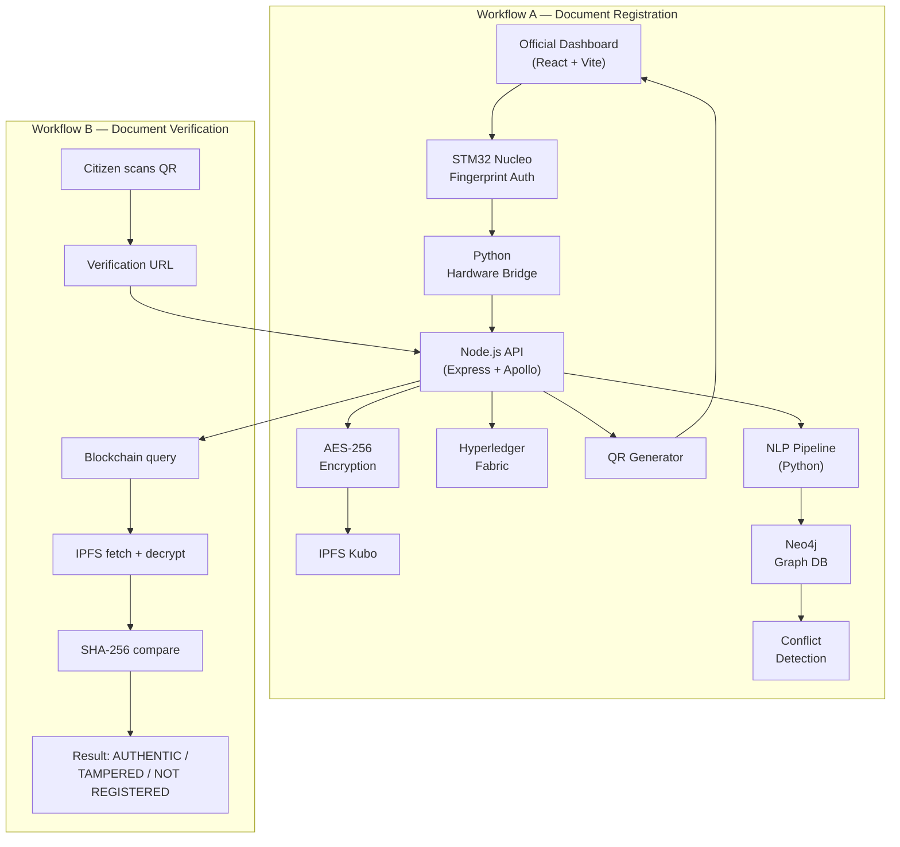

# LexNet — Complete Implementation Plan

> AI-powered blockchain legal document networking system.
> This plan is split across multiple files for readability.

## Table of Contents

| # | Section | File |
|---|---------|------|
| 1 | [Full Folder & File Tree](file:///C:/Users/sbrbs/.gemini/antigravity/brain/aa37d9b8-3977-4d6d-bd30-54083b104657/plan_01_file_tree.md) | `plan_01_file_tree.md` |
| 2 | [Module-by-Module Build Order](file:///C:/Users/sbrbs/.gemini/antigravity/brain/aa37d9b8-3977-4d6d-bd30-54083b104657/plan_02_build_order.md) | `plan_02_build_order.md` |
| 3 | [File-by-File Implementation Details](file:///C:/Users/sbrbs/.gemini/antigravity/brain/aa37d9b8-3977-4d6d-bd30-54083b104657/plan_03_file_details.md) | `plan_03_file_details.md` |
| 4 | [All API Endpoints](file:///C:/Users/sbrbs/.gemini/antigravity/brain/aa37d9b8-3977-4d6d-bd30-54083b104657/plan_04_api_endpoints.md) | `plan_04_api_endpoints.md` |
| 5 | [All Environment Variables](file:///C:/Users/sbrbs/.gemini/antigravity/brain/aa37d9b8-3977-4d6d-bd30-54083b104657/plan_05_env_vars.md) | `plan_05_env_vars.md` |
| 6 | [Database Schemas](file:///C:/Users/sbrbs/.gemini/antigravity/brain/aa37d9b8-3977-4d6d-bd30-54083b104657/plan_06_db_schemas.md) | `plan_06_db_schemas.md` |
| 7 | [Inter-Module Communication Contracts](file:///C:/Users/sbrbs/.gemini/antigravity/brain/aa37d9b8-3977-4d6d-bd30-54083b104657/plan_07_contracts.md) | `plan_07_contracts.md` |
| 8 | [Testing Plan](file:///C:/Users/sbrbs/.gemini/antigravity/brain/aa37d9b8-3977-4d6d-bd30-54083b104657/plan_08_testing.md) | `plan_08_testing.md` |
| 9 | [Docker Setup](file:///C:/Users/sbrbs/.gemini/antigravity/brain/aa37d9b8-3977-4d6d-bd30-54083b104657/plan_09_docker.md) | `plan_09_docker.md` |
| 10 | [Week-by-Week Build Checklist](file:///C:/Users/sbrbs/.gemini/antigravity/brain/aa37d9b8-3977-4d6d-bd30-54083b104657/plan_10_weekly.md) | `plan_10_weekly.md` |

## Architecture Diagram

## Hard Constraints Enforced

- All free/open-source (only paid: Indian Kanoon non-commercial tier)
- Fully local — no cloud deployment
- 4 students × 15 weeks × 4-6 hrs/week = 240-360 person-hours budget
- Every function signature is concrete — no placeholders
- Every error path documented
- Security at every layer
