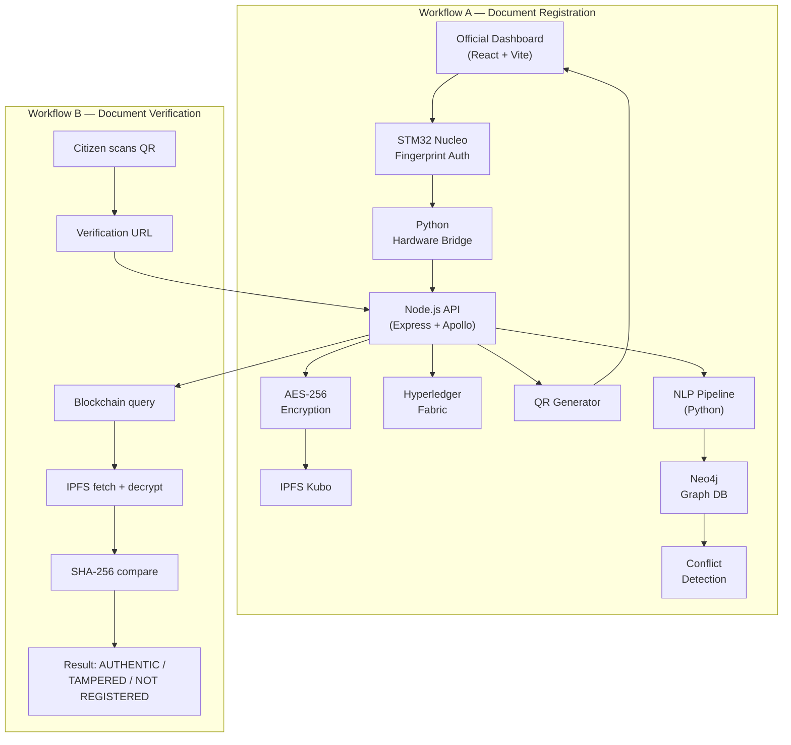

# LexNet — Complete Implementation Plan

> AI-powered blockchain legal document networking system.
> This plan is split across multiple files for readability.

## Table of Contents

| # | Section | File |
|---|---------|------|
| 1 | [Full Folder & File Tree](file:///C:/Users/sbrbs/.gemini/antigravity/brain/aa37d9b8-3977-4d6d-bd30-54083b104657/plan_01_file_tree.md) | `plan_01_file_tree.md` |
| 2 | [Module-by-Module Build Order](file:///C:/Users/sbrbs/.gemini/antigravity/brain/aa37d9b8-3977-4d6d-bd30-54083b104657/plan_02_build_order.md) | `plan_02_build_order.md` |
| 3 | [File-by-File Implementation Details](file:///C:/Users/sbrbs/.gemini/antigravity/brain/aa37d9b8-3977-4d6d-bd30-54083b104657/plan_03_file_details.md) | `plan_03_file_details.md` |
| 4 | [All API Endpoints](file:///C:/Users/sbrbs/.gemini/antigravity/brain/aa37d9b8-3977-4d6d-bd30-54083b104657/plan_04_api_endpoints.md) | `plan_04_api_endpoints.md` |
| 5 | [All Environment Variables](file:///C:/Users/sbrbs/.gemini/antigravity/brain/aa37d9b8-3977-4d6d-bd30-54083b104657/plan_05_env_vars.md) | `plan_05_env_vars.md` |
| 6 | [Database Schemas](file:///C:/Users/sbrbs/.gemini/antigravity/brain/aa37d9b8-3977-4d6d-bd30-54083b104657/plan_06_db_schemas.md) | `plan_06_db_schemas.md` |
| 7 | [Inter-Module Communication Contracts](file:///C:/Users/sbrbs/.gemini/antigravity/brain/aa37d9b8-3977-4d6d-bd30-54083b104657/plan_07_contracts.md) | `plan_07_contracts.md` |
| 8 | [Testing Plan](file:///C:/Users/sbrbs/.gemini/antigravity/brain/aa37d9b8-3977-4d6d-bd30-54083b104657/plan_08_testing.md) | `plan_08_testing.md` |
| 9 | [Docker Setup](file:///C:/Users/sbrbs/.gemini/antigravity/brain/aa37d9b8-3977-4d6d-bd30-54083b104657/plan_09_docker.md) | `plan_09_docker.md` |
| 10 | [Week-by-Week Build Checklist](file:///C:/Users/sbrbs/.gemini/antigravity/brain/aa37d9b8-3977-4d6d-bd30-54083b104657/plan_10_weekly.md) | `plan_10_weekly.md` |

## Architecture Diagram



## Hard Constraints Enforced

- All free/open-source (only paid: Indian Kanoon non-commercial tier)
- Fully local — no cloud deployment
- 4 students × 15 weeks × 4-6 hrs/week = 240-360 person-hours budget
- Every function signature is concrete — no placeholders
- Every error path documented
- Security at every layer

## Legal-BERT NER Fine-Tuning and Export Plan

### Objective

Add a fine-tuned Legal-BERT token-classification model to NLP2 so the NER pipeline uses transformer inference first and keeps spaCy/regex as fallback.

### Required Target Labels

The final effective label space must map to these LexNet labels:

- PERSON
- PROPERTY_ID
- SURVEY_NUMBER
- DATE
- MONETARY_VALUE
- JURISDICTION
- LEGAL_SECTION
- ORGANISATION

Reference files:

- nlp/data/ner_labels.json
- nlp/.env.example
- nlp/src/pipeline/ner.py

### Scope

- Fine-tune Legal-BERT for token classification on legal document text.
- Export model artifacts with save_pretrained.
- Ensure labels align with LexNet NER labels (directly or via supported mapping).
- Place exported artifacts into the path configured by NER_MODEL_PATH (default: ./models/legal-bert).
- Verify runtime readiness through NLP health endpoint.

### Phase 1 - Dataset and Label Design

1. Build token-level training data using BIO scheme (recommended) or plain entity labels.
2. Maintain one canonical mapping document from dataset labels to LexNet labels.
3. If dataset uses aliases, map before training or in export metadata:
    - PER -> PERSON
    - ORG -> ORGANISATION
    - MONEY -> MONETARY_VALUE
    - LAW -> LEGAL_SECTION
    - GPE/LOC/FAC -> JURISDICTION
4. Ensure every training sample has valid spans and no overlapping contradictory tags.

Exit criteria:

- Label inventory is complete and traceable to all 8 LexNet labels.
- Validation split includes examples for each label.

### Phase 2 - Fine-Tuning Pipeline

1. Use base model: nlpaueb/legal-bert-base-uncased.
2. Create explicit label2id and id2label dictionaries at training start.
3. Train with AutoModelForTokenClassification and a data collator for token classification.
4. Evaluate with token-level F1/precision/recall and class-wise breakdown.
5. Reject checkpoints with weak minority-label recall (for example, SURVEY_NUMBER, LEGAL_SECTION).

Recommended training outputs:

- Best checkpoint directory
- metrics.json
- confusion summary by label

Exit criteria:

- Chosen checkpoint has acceptable overall F1 and no critical label collapse.
- id2label values are meaningful labels, not generic LABEL_0 style names.

### Phase 3 - Export with save_pretrained

1. Export tokenizer and model from the selected checkpoint:

```python
model.save_pretrained(export_dir)
tokenizer.save_pretrained(export_dir)
```

2. Verify exported directory contains:
    - config.json
    - model.safetensors (or pytorch_model.bin)
    - tokenizer.json (or vocab/tokenizer config files)
3. Validate config.json includes id2label/label2id and matches training label setup.

Exit criteria:

- Export directory can be loaded offline by Hugging Face AutoConfig, AutoTokenizer, and AutoModelForTokenClassification.

### Phase 4 - Model Placement and Runtime Wiring

1. Confirm env setting in nlp/.env.example:
    - NER_MODEL_PATH=./models/legal-bert
2. Place exported directory at:
    - Host runtime path: nlp/models/legal-bert
    - Docker runtime path: /app/models/legal-bert (via mounted volume)
3. Keep nlp/data/ner_labels.json unchanged unless label set itself changes by design.

Exit criteria:

- Runtime can resolve NER_MODEL_PATH and read model artifacts.

### Phase 5 - Verification and Acceptance

1. Start NLP service.
2. Call GET /nlp/health.
3. Confirm:
    - legalBertModelPath.exists = true
    - legalBertModelPath.loadedForTokenClassification = true
    - runtimeReady = true
4. Run NER tests and sample extraction checks for all critical labels.
5. Validate fallback remains functional when transformer path is intentionally unavailable.

Acceptance checklist:

- Fine-tuned model loads with local_files_only behavior.
- Extracted entities map to LexNet labels.
- No regression in existing spaCy/regex fallback behavior.

### Execution Backlog (Actionable Tasks)

1. Prepare and validate BIO-tagged dataset.
2. Implement or run token-classification training job.
3. Export best checkpoint using save_pretrained.
4. Copy exported files to NER_MODEL_PATH target.
5. Verify health endpoint and run NER tests.
6. Document model version, dataset version, and metrics in release notes.

### Risks and Mitigation

- Risk: Generic LABEL_n config labels block transformer loading.
  - Mitigation: enforce explicit id2label/label2id before training.
- Risk: Domain mismatch produces low recall on legal entities.
  - Mitigation: augment training data for SURVEY_NUMBER, LEGAL_SECTION, PROPERTY_ID.
- Risk: Docker path mismatch causes false deployment success.
  - Mitigation: validate inside running container at /app/models/legal-bert.

### Done Definition

- A fine-tuned Legal-BERT token-classification model is exported and mounted at NER_MODEL_PATH.
- Health endpoint reports model loaded for token classification.
- End-to-end NLP2 extraction uses transformer outputs with fallback safety intact.
