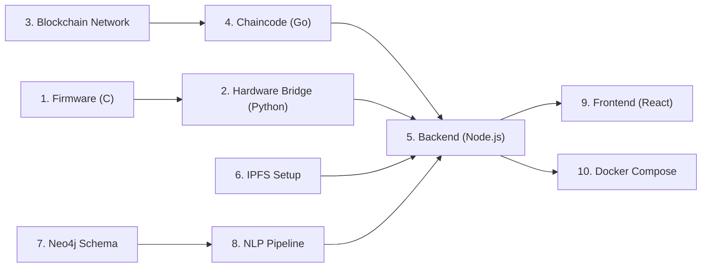

# Section 2 — Module-by-Module Build Order

[← Back to Index](file:///C:/Users/sbrbs/.gemini/antigravity/brain/aa37d9b8-3977-4d6d-bd30-54083b104657/implementation_plan.md)

## Critical Path

## Build Sequence

### Phase 1 — Firmware + Hardware Bridge (Parallel Track A)

| Order | Module | Why this order |
|-------|--------|---------------|
| **1** | `firmware/` (STM32 C code) | Zero dependencies on other modules. The UART packet format must be defined first because the hardware bridge and backend both depend on it. Building firmware first also surfaces hardware issues early. |
| **2** | `hardware-bridge/` (Python) | Depends only on the UART packet format from firmware. Can be tested with `stm32_simulator.py` without real hardware. Must be ready before backend because the backend's `/api/auth/hardware` endpoint consumes bridge JWTs. |

### Phase 2 — Blockchain + Storage (Parallel Track B)

| Order | Module | Why this order |
|-------|--------|---------------|
| **3** | `blockchain/network/` | Must be operational before chaincode can be deployed. Fabric peer + orderer + CA containers must run, channel must be created. No dependency on any other LexNet module. |
| **4** | `blockchain/chaincode/` (Go) | Depends on network being up. All 8 chaincode functions must be tested against the running network. The backend's `fabricService.ts` directly calls these functions, so their signatures must be finalised here. |

### Phase 3 — Core Backend

| Order | Module | Why this order |
|-------|--------|---------------|
| **5** | IPFS Kubo setup | Just `docker run` — no code to write, but must be reachable before the backend's `ipfsService.ts` can upload/retrieve files. |
| **6** | `backend/` (Node.js API) | The central hub. Depends on: chaincode signatures (Phase 2), hardware bridge JWT format (Phase 1), IPFS endpoint (step 5). Build in this internal order: `config/` → `services/` → `middleware/` → `rest/` → `graphql/`. |

### Phase 4 — NLP + Graph

| Order | Module | Why this order |
|-------|--------|---------------|
| **7** | `neo4j/` (schema + seed) | Neo4j must have constraints/indexes before the NLP pipeline inserts data. Also needed for backend's `neo4jService.ts`. Run schema.cypher + seed.cypher against a running Neo4j instance. |
| **8** | `nlp/` (Python pipeline) | Depends on Neo4j being up and seeded. Consumes documents from the backend (triggered via HTTP). Inserts into Neo4j. Must be built after the graph schema is finalised. |

### Phase 5 — Frontend + Integration

| Order | Module | Why this order |
|-------|--------|---------------|
| **9** | `frontend/` (React) | Depends on all backend GraphQL/REST endpoints being available. Build pages in order: Login → Register → Verify → GraphExplorer → Conflict → Timeline → DocumentDetail. |
| **10** | `docker/` | Last because it composes all services. Can only be validated when every service runs individually. |
| **11** | `data/` + `docs/` | Sample data scripts and documentation. Can be done in parallel with any phase but are finalised last. |

## Parallel Work Assignment (4 Students)

| Student | Weeks 2-3 | Weeks 4-5 | Weeks 6-7 | Weeks 8-9 |
|---------|-----------|-----------|-----------|-----------|
| **S1 (Embedded)** | Firmware + Bridge | Bridge ↔ Backend integration | Hardware demo polish | Final testing |
| **S2 (Blockchain)** | Fabric network + Chaincode | Backend Fabric/IPFS services | Docker compose | Documentation |
| **S3 (AI/ML)** | NLP pipeline (OCR+NER) | Relation extraction + Conflict model | Neo4j integration | Training data |
| **S4 (Frontend)** | React scaffold + Login + Verify | Graph Explorer + D3.js | Conflict dashboard + Timeline | UI polish |

> [!WARNING]
> **S2 and S3 converge in Week 6** when the NLP pipeline must write to Neo4j and the backend must read from it. Plan a 2-hour integration session at the start of Week 6.
